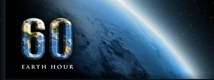

For those of you who hadn’t heard, today is the day of [Earth Hour](http://www13.earthhourus.org/), a event set up by the WWF to show support against global warming and climate change. From their website:

> On March 29, 2008 at 8 p.m., join millions of people around the world in making a statement about climate change by turning off your lights for Earth Hour, an event created by the World Wildlife Fund.
> 
> Earth Hour was created by WWF in Sydney, Australia in 2007, and in one year has grown from an event in one city to a global movement. In 2008, millions of people, businesses, governments and civic organizations in nearly 200 cities around the globe will turn out for Earth Hour. More than 100 cities across North America will participate, including the US flagships–Atlanta, Chicago, Phoenix and San Francisco and Ottawa, Montreal, Toronto and Vancouver. View cities involved around the world.
> 
> We invite everyone throughout North America and around the world to turn off the lights for an hour starting at 8 p.m. (your own local time)–whether at home or at work, with friends and family or solo, in a big city or a small town.

So if you believe in these issues, then shut your lights off at 8pm local time for an hour.

\* Also, I need to top up my Apple TV is US funds. Are any of my readers american? If so, can I paypal you some money that you can use to buy me a quick gift card, and then send me the code? You will keep me very happy, and I’ll even blog about it! Thanks.