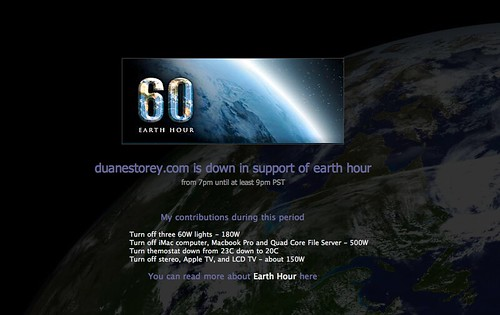

I spent most of the last hour on the couch, just thinking by candlelight. It was a nice break from the norm, having a dark apartment sans the sound of computer fans spinning or other randomness that goes beep in the night.

Looking out my window, it’s hard to tell just how many people participated. It seems slightly darker than normal I guess, but for the most part it looks like business as usual in this city.

For those of you who missed it, I took my site down for a few hours in support of the event. Here’s a snapshot [Rebecca](http://miss604.com) took:

And lastly, I just want to mention that WordPress 2.5 was just released, so if you’re looking for an upgrade, now’s a good time (and in fact, many of you are running less than 2.3.3, which is a very bad idea since those versions are totally hackable). There are major UI changes in the dashboard, some of which will involve a bit of relearning. But I’ve been watching the wp-testers group, and those guys have been working hard to bring you something great.