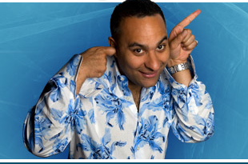

At this time tomorrow, I’ll be bouncing around Calgary trying to get my media pass before the press conference at noon. Which means I get to spend most of tonight getting my camera gear ready and packing some clothes.

[Photo from Russell Peter’s Website](http://www.russellpeters.com/)My flight is at 7am in the morning, and I hope to have a few minutes in the airport relaxing with a coffee and an eggs benedict. I’m pretty excited about going to the Junos, and really have no idea what to expect. Russell Peters will be at the press conference tomorrow, so hopefully I’ll get to chat with him a bit — I’m a big fan of some of his comedy skits.

Also, make sure you bookmark my [Juno Awards Page](http://www.migratorynerd.com/2008-juno-awards) which I’ll update while I’m out there. Also, check out [Urban Vancouver](http://urbanvancouver.com), where I’ll also be doing the odd posting as well.