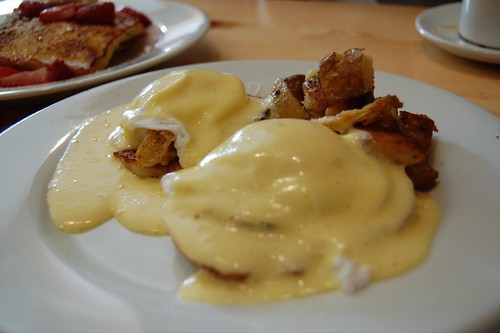

It’s 6am, and I’m currently sitting on a chair at the Vancouver International Airport waiting to get on my flight to Calgary. I was really looking forward to having a nice hot eggs benedict at the airport, but the airport decided to close Milestone’s for me, so I’m SOL I guess. My only options right now are unripe raw bananas or my favourite liquid diet, diet pepsi. If I would have had eggs benedict though, they might have looked like this:

[Photo by lehedonist on Flickr](http://www.flickr.com/photos/lehedonist/)

I didn’t get to sleep until well after 2am, so 5am came really early for me. I’m pretty beat, and can’t wait to get on the plane so I can try and get 30 minutes of sleep. I’m pretty much guaranteed to be going non-stop once I land in Calgary, at least until the early afternoon, at which point I’ll probably head back to the hotel and have a nice nap before tonight. I think there’s some welcome reception later in the evening, but I’m really not sure.

Normally going through security with a bag full of electronics is a major hassle for me, but this time nobody seemed to care at all. In fact, they seemed more interested in some purse belonging to this little old lady than they did any of my camera gear or computer equipment.

While I’m not a big fan of hotels, I”m definitely looking forward to getting a good night’s sleep somewhere it’s quiet. That’s the one part of my apartment in Vancouver that’s been bothering me lately — it’s really loud being sandwiched between two bridges, and the noise often keeps me up at night. One of the best sleeps I had all of last year was in Las Vegas, partially because I was so tired, but mostly because the room was so well insulated.

I’m going to chug down the rest of this pop, and then spend the next 15 minutes surfing the internet until the plane boards. Most likely the next post will be after the press conference in Calgary, at which point I should have my first batch of photos to post (I haven’t touched my camera in over a month, I hope I can remember how to take photos).

\*\* this post was brought to you by Vancouver Airport’s generous $12/hour wireless internet