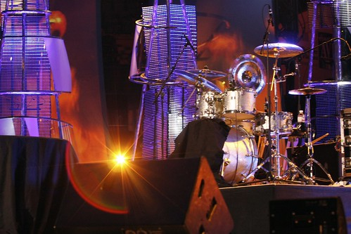
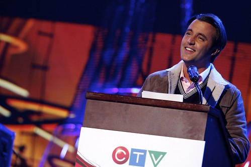
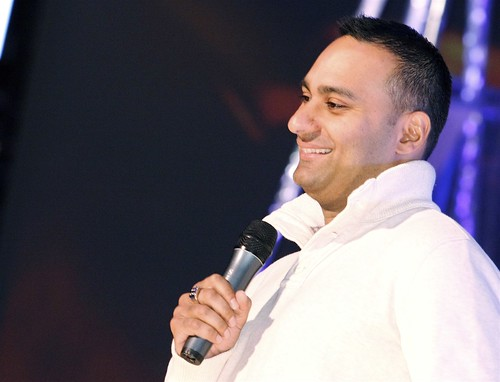
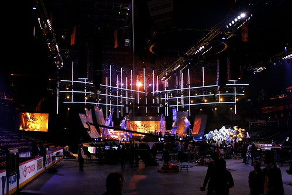

I just got back from an invite-only press conference inside the Calgary Saddledome. Inside, we got to get our first glimpse of the set for the 2008 Canadian Juno Awards.

A Shot Of The Stage At The Junos

To be honest, I was a bit worried about being here, given that I’m not really a mainstream media person. But after seeing how everyone else handled themselves, I no longer feel that out of my element.

Ben Mulroney, The Host Of [Canadian Idol](http://www.ctv.ca/idol/gen/Home.html)

In fact, watching everyone else take photos and set up huge camera equipment, I realized I’m probably one of the only people there that will be able to post stuff within a few hours of being at an event out here.

[Russell Peters](http://www.russellpeters.com/), The Host Of The Juno Awards

In fact, even as I type this I have two movies uploading, one that gives a live demonstration of the lights and effects at the Juno awards, and another of Russell Peters doing what he does best.

The Set From The 2008 Juno Awards

It was pretty cool standing beside some of the media celebrities out here in Calgary. After I picked up my media pass this morning, I ran into some kids who were like “wow, you’re photographing at the Junos? So cool!” I thought it was totally cute, and made my morning.

The next function I have is around 6pm I think, but I might go out and buy a new memory card for my camera, since 1GB of SD just isn’t enough for videos.