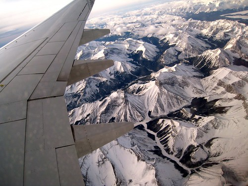

I currently just flew past Kelowna, and according to the in-seat GPS unit, am hurtling across BC at around 32000 feet. It was raining on the ground in Vancouver, but the sun is shining way up here amongst the clouds. Latest weather report from the cockpit says it’s -6C in Calgary (I should have packed some warmer clothes), so it’s going to be a slight adjustment when I land.

I spent the last 15 minutes reading all the emails I’ve been sent from the Junos media committee (something I probably should have done a few days ago). It turns out there’s a lot more going on than I originally realized, and I think I’m going to be fairly busy in the next 72 hours.

The press conference starts around noon today and will feature Russell Peters as well as a live performance or two. The event is sponsored by CTV, and we’ll get to see the entire setup for the Juno ceremonies, which should be a pretty cool photo opportunity. That goes until around 2pm or so, and then I’ll have a bit of time to unwind and regain my bearings. At 6pm tonight is the welcome reception in the imperial ballroom of the Hyatt Regency hotel. According to my media briefing, The Dudes, Lindsay Ell, Justin Rutledge, Bill Manzar and God Made Me Funky will all be performing. I’ll spend some time during the break this afternoon reading up on all of them. If anyone is a fan drop me a comment and let me know.

I’ve re-read everything I have a few times already, and I find I’m still struggling to figure out just what it means to be a photographer during the two main events tomorrow and Sunday. It seems like there are a few photo pits available for guys like me, but they are fairly far (95ft and 135ft respectively) from the stage. It also seems like that I can just hang out in the media room and take photos from there, which I might end up doing. I guess I’ll just have to wait and see what it looks like in person.

The person next to me on the plane was easily the most computer-addicted person I’ve ever seen. The moment he sat down in his seat he pulled his laptop out and started fiddling with it. He then asked the stewardess how soon after take off he could open it up and use it. The moment the wheels went up the guy was frantically trying to start up. And when it was finally up, know what he did? He moved icons around his desktop for an hour. When the plane landed and everyone was disembarking, I literally had to ask him to pack his laptop up so I could get by him and exit the plane. Time to unplug pal.