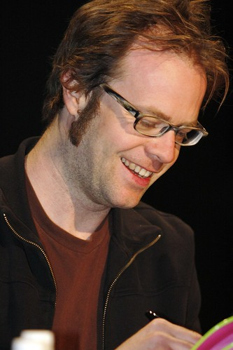
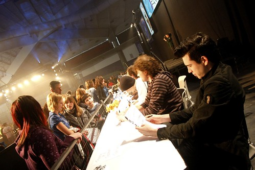

I woke up this morning at around 10am, close to being rested, but not 100%. The stupid alarm clock in my hotel room started going off at 4:30am, and it took me like 10 minutes to figure out how to shut it off. No matter.

I cabbed down to the University this morning to check out the Juno Fan Fare. It’s basically a huge event where the fans can line up and get autographs from their favourite groups. Media access to this event wasn’t that great. They had set up two photo pits on either side of the autographing areas, but due to the location of them, the angles on the shots were fairly horrible. A few photographers were going “out of bounds” and attempting to get better shots, which made for a few encounters between them and security.

I took the high ride and simply shot where I was told. I don’t really get the mass appeal of photographing celebrities, so I mostly spent my time walking around. I actually went beside some fans and took a few photos, only to be told by security that the media wasn’t allowed to photograph there. To which I commented “by these other 100 people are allowed to?”

The event lasts four hours, but I bailed after 45 minutes. I’m just relaxing for a few minutes, and then heading out to the Penthouse at the Fairmont for a gathering related to the 2009 Junos in Vancouver.

The Gala starts around 4:30pm for the media. I’m really not sure what to expect at all, or where I’ll be positioned to take photographs. I’m also heading to some club later to shoot some Red Carpet action (although, I’m less excited about this since learning that the media isn’t actually allowed inside the club). That reminds me of this Cuban architect I met once who designed fancy vacation resorts, but wasn’t actually allowed to step foot inside of them.