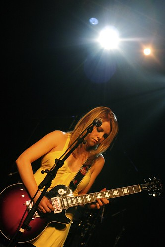
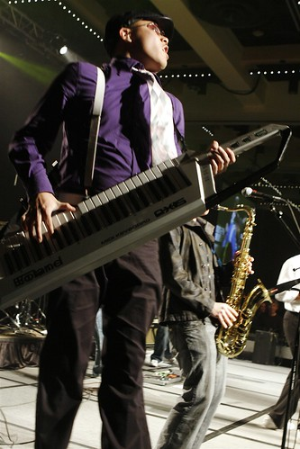
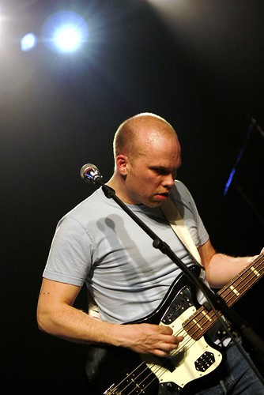

Wow. That’s all I can say. I really had no idea what to expect, but the event so far has completely blown away all my expectations. Sometimes when you get a media pass you can’t really do anything. Contrast that with my pass, where I can basically do whatever I want. I literally have walked into any room I’ve wanted and photographed whatever I have wanted. I was up front, literally three feet from the stage, using both my SLR and my video camera during the whole night, all while drinking free beer and chatting with cute girls in cowboy hats. I’m not coming home.

I uploaded a pile of photos to my Flickr account, but here are a few teasers. First, the lovely Miss Lindsay Ell:

Daniel, from God Made Me Funky:

The Dudes:

It’s only 9:50pm, and I’m beat. I’ve taken 1GB worth of movies and 4GB worth of photos already, and it’s only day one. I’ll post more later — I gotta go see about a girl. In a cowboy hat.

Here’s a quick video from The Dudes while I’m out hitting on cute girls.

\[blipit id=800725\]

Oh what the heck, here’s some Justin Rutledge too:

\[blipit id=800715\]

Seriously, this is so awesome, there aren’t enough words to describe it.