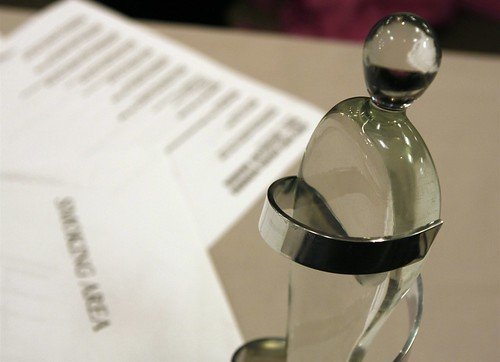

I picked up a cab and headed down to the Saddledome to attend the Junos tonight. However, as soon as I got to the front door, I was told that I wasn’t allowed inside by some lady. Of course, I received countless emails that said I had access to this event, which of course I tried to explain to her. Her argument was that those emails didn’t mean anything, and that they were limited by space. Eventually she let me in, but it was a rather big hassle.

The media room here is fairly nuts. There are about twice as many photographers as last night, but they are stuffed in about half of the space. I went down and looked at the photo pit in the stadium, but I think it’s just going to be too crowded, and I’m not going to bother. I’ve even a bit concerned getting photos in the media room since they are just so many people here, all trying to get shots.

While I like taking photos, I’m not a big fan of having to fight to take a photo. But we’ll see what happens. The actual event doesn’t start until 6pm, which is two hours away. So for now I’m just going to surf the internet and work on some photos from last night.