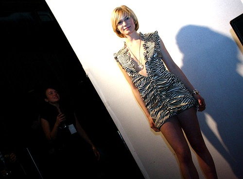
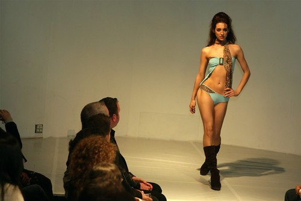

Tomorrow marks the first event for [the Vancouver Fashion Week, 2008 Spring Edition](http://www.vanfashionweek.com/info.html). I had a media pass last year and spent a few evenings taking photos. If I remember correctly, the only downside to the event (in my opinion) was that I thought most of the models lacked enthusiasm. I also remember wishing I had brought a flash to the opening event, so if anyone is going, I’d recommend bringing one.

While I love photography, it’s fairly dull sitting at the end of a runway for an hour taking the same shot over and over again, and I really appreciated the models that mixed it up a bit or added their own personal flare to the event.

Tomorrow is basically the opening Gala at the Opus Hotel, followed by an event at Bar None. Once again I have a media pass, so I’ll have full access to the events. Unfortunately, because I’m still fighting bronchitis, I will probably miss tomorrow’s event. If I’m feeling up to it on Thursday night, I’ll probably catch a session and swing by the after party to see what it’s like this year. Or I might just come home and watch a movie.