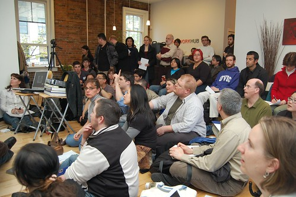

Last night was Vancouver’s first ever [WordCamp](http://ma.tt/2008/04/wordcamp-in-vancouver/) down at the [Network Hub](http:/www.thenetworkhub.ca) downtown. I got there about 15 minutes early, and was fairly amazed that it was already standing (or sitting, if you will) room only. There were so many people in fact, that they wrapped around the edges into locations where you couldn’t even see the projector. Clearly Vancouver has a very large and supportive WordPress community.

  
Photo by [John Biehler](http://flickr.com/photos/retrocactus)

The open-source community in Vancouver is pretty amazing. Whenever I travel and tell others this, they are always suspect, like it would somehow be impossible for our little corner of the world to have any talent or innovation. And yet, I’m constantly amazed at the level of depth, the passion, and the good nature of most people in the Vancouver blogging community.

A big thanks to the Network Hub and Tazzu for organizing the whole event, and for [Automattic](http://automattic.com) for picking up the first round of drinks. Definitely looking forward to the next one.

For those of you who caught my talk last night and are looking for the WordPress iPhone theme, you can [grab a copy of it here.](http://www.bravenewcode.com/wptouch/)