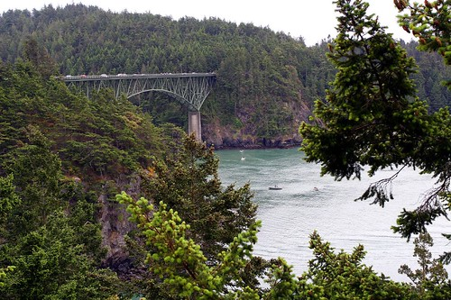

Being that this weekend is the May long weekend, and unofficially (at least in British Columbia circles) the start of summer, I thought I might get in the car and take a little road trip. My sister and the kids are camping near Deception Pass in Washington, State, and I’m seriously considering hopping in the car later tonight and making the trek down to hang out with them.

It’s supposed to be 30C, which is rather nice weather to be sitting outside. I have to see what the state of my camping gear is in the back of my car, but assuming it’s all there are prepped to go, I might head out around 8pm and see if I can get across the border.