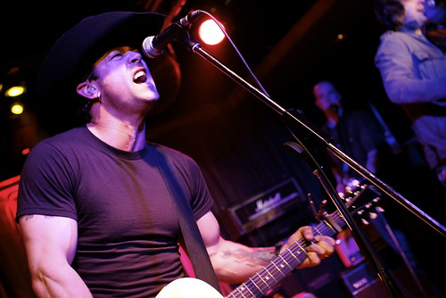

Tonight was a jam packed night. I left work around 7pm, and then headed down Granville Street, frantically looking for something to eat. I actually walked into Wings, but it was completely full. So eventually I settled on my old-faithful nacho-haven, the Two Parrots. They had a 35 cent wing special on, so I filled up with that.

Eventually I ended up at some Spanish place (coincidentally, it’s only one block from my place, and I had never been there) to celebrate [Raul’s](http://hummingbird604.wordpress.com) graduation from UBC with his Ph.D. (congrats dude, well, deserved). Good times.

As some of you know, this weekend is [New Music West](http://www.newmusicwest.com/) in Vancouver. I actually had a media pass to attend all the functions, but because I’ve been so busy at work, I haven’t had time to go pick it up. Thankfully [Miss604](http://miss604.com) lent me her photographer pass so I could head down and take a few photos tonight.

The first show of the night was country music cutie, [Jessie Farrel](http://jessiefarrell.com/news/). There weren’t many people in our group who were country music fans, but thankfully Brennen blasted it at my head for the four years we were at university together, and I have a soft spot in my heart for country music. I caught her act (which was great), along with a few others.

However, what happened next was a huge damper on the evening. As I mentioned, we were at the Red Room in Vancouver. I’m going to prefix the next part by saying the following:

- I’m a chubby Ukrainian
- I can drink my weight in alcohol
- I’ve been in bars all over the world – Tokyo, New York City, San Francisco, Seattle, Vancouver, Toronto, you name it

So, I’ve been to enough clubs in my mind to know how most of them operate. My friend Ianiv, who wasn’t drinking during the night, went up to the bar and asked for a water. At that point, the lady told him that water, even **tap water** would cost him money, unless of course he bought a bunch of booze. Being a reasonable, sober guy, he was obviously disappointed, and thought it was rather idiotic that he would have to go to the bathroom to drink water, or drink some booze and then drive home. While talking to the waitress, the bouncer decided to go up to him and tell him basically to stop arguing with the waitress, and pay up for his water.

To be honest, I hate power-tripping bouncers, as much as I hate stupid bar rules. I went up to the bar to find out what was going on, and, considering I had spent some cash on booze myself during the night, asked that Ianiv be allowed to drink **tap water** for free, but it was to no avail. So I just threw his water on my tab.

Like I said, I’ve traveled all over the world, and I have yet to encounter another bar that didn’t give you a glass of water when you needed it. I went up afterwards and talked politely to the waitress, and voiced my obvious disappointment with the rules (considering drinking and driving is illegal, I am suspect of any place that won’t give you water if you ask for it). And while she was sympathetic, she said it was **the rules set by the management of the establishment, and there was nothing they could do about it**. To add insult to injury at this point, she informed me that there would be a $2 surcharge to any purchase I made if I were to use visa or debit. At that point I was done arguing, and just told her to throw another $2 on it if that’s how they rolled in the bar.

I don’t normally use my blog to bash establishments, but I think the [Red Room](http://www.redroomonrichards.com/) has a bunch of really terrible policies in place. There’s no way, in my mind, that any bar should be allowed to charge for tap water, especially given that drinking and driving is illegal and dangerous, and that we live in one of the most water-rich places in the world. So, make up your own mind where you want to go during New Music West, or after, but I for one won’t be heading back to [The Red Room](http://www.redroomonrichards.com/).