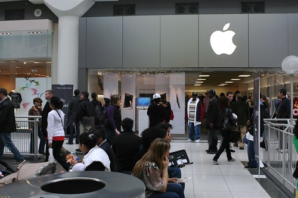

Well, by now everyone and their dog has blogged this, but I’ll jump on the band wagon as well. [Rebecca](http://www.miss604.com/2008/05/apple-store-in-pacific-centre-vancouvers-new-meet-market.html) just pinged me on iChat and told me about the opening of the new Apple store this Saturday. To be honest, it comes as a fairly big surprise given the state they were in last month (based on rumours). Obviously I think it’s a pretty cool thing that they are opening this weekend.

Considering that many of the rumour sites are alluding to big announcements from Apple on June 9th at the developer conference, I can’t help but think the construction of the Vancouver store was accelerated for some of those reasons. In particular, I expect we will see the new 3G iPhone at the Vancouver store sometime in June, and I suspect something along those lines will be announced at the developer conference.