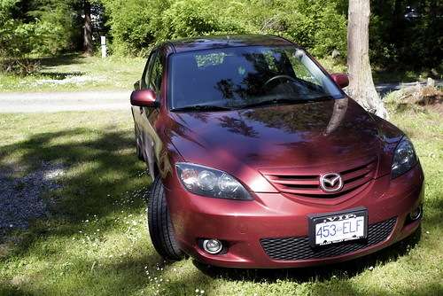

A few years ago my mom convinced me that I should finally ditch my 1993 Toyota Tercel (which seemed to be running on only 3 cylinders) and upgrade to something nicer. After spending a few days test driving cars, I finally went out and bought a 2006 Mazda 3 Sport Hatchback.

For the most part, it’s been a really great car. The mileage isn’t super amazing (it’s not that bad either, but definitely no Prius), but it’s fun to drive and it looks pretty sexy (for a hatchback). The only downside is that last year Mazda admitted to a problematic design flaw in the locking mechanism, one that allowed intruders to enter your car simply by [banging the door in the correct spot](http://www.canada.com/globaltv/calgary/features/consumer_advocate/story.html?id=5c17f9ed-2d90-477e-991f-424d9cd883a6):

> If you own a 2004 to 2006 Mazda 3, the cars are are prone to break-ins and Mazda owners aren’t happy.
> 
> Casey Archibald and Bev Cunningham are not only friends, they bought the same model car. Now they’re also victims of the same crime. On May 2nd someone broke into his Mazda 3 downtown and the same thing happened to her May 6th outside her house.
> 
> “There was a dent just above the drivers handle and the car was open and it had been gone through”, says Cunningham.
> 
> “The door was dented and access was gained and only change stolen”, says Archibald.
> 
> After checking the internet they discovered they’re not alone. Since early this year Mazda 3 owners in Western Canada been reporting similar break-in’s. First in B.C. and about a month ago in Calgary. In every case there’s a dent in the door above or below the lock. Mazda Canada says it’s been aware of the problem since October 2006 but says it isn’t a defect. They say the same thing could happen to any vehicle.

I received a letter in the mail from Mazda about six months ago saying that they’d install a hard metal plate behind the door panels to prevent that type of break-in. I hadn’t really thought about it since, but since I noticed a nice big dent on my passenger door last week (which may or may not be related, but it’s definitely possible someone was trying to gain entry), I decided to go do something about it.

So yesterday I dropped my car off down at the Mazda dealership on Hastings. They installed the metal plate thing, and also added a shock sensor to the built-in alarm system so that any hit on the car will set off the alarm. And while I guess it’s a good way to prevent people from actually gaining entry to the car, it doesn’t really stop anyone from trying to enter it by putting a big dent in the side. As it is I’m already looking at $300 and a whack of my own time to fix the current dent.

Hopefully as more people take the free upgrade from Mazda thieves will be less and less likely to attempt to break into this car. I’ve read stories of some people on the internet being broken into this way every few weeks or so in Calgary, and I’m thankful my car hasn’t experienced anything like that.