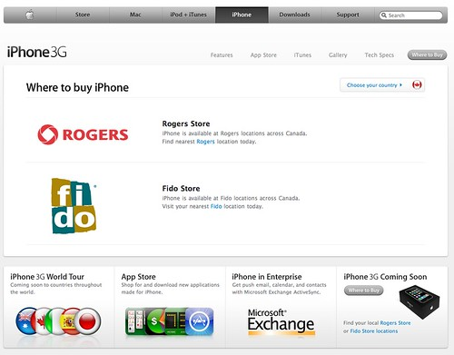

I stopped by the new Vancouver Apple store on my way to work to hang out with John Biehler and watch a bit of Steve Job’s keynote. Obviously the question on everyones’ mind basically revolved around the 3G iPhone that was rumoured to be announced.

The good news is that the release date for the iPhone in Canada has been officially set for July 11th. The bad news is that not only is the jury is still out on just what type of data plans Rogers and Fido are going to be offering with the plan, but also most of the Rogers and Fido people [seem completely clueless about the offerings](http://johnbiehler.com/2008/06/09/july-11th-is-the-new-canada-day/).

The first comment I have to make is that the new price for the 3G iPhone is $199, which is significantly less than I paid for my iPod touch. The rumours in the last couple of days alluded to the fact that Apple is going to allow carrier subsidies for the phones, so based on the announced price point, I’m going to conclude that you can only get it that cheap if you choose to lock into a 2-3yr contract with Rogers. In fact, some of Rogers current data plans require a contract, so it’s looking fairly likely that new 3G iPhone users in Canada will be forced to get a contract. I hope that’s not the case, but we’ll see.

In addition, based on a screenshot John took of Apple’s new 3G website portion, it looks like you can only pick up the phone in a Rogers or Fido outlet (i.e. not online or at the Apple store), which basically adds weight to my belief that it will be available on a contract basis only. I’ve been screwed over by contracts a few times already, and I really don’t want to lock into a new contract going forward. That’s not to say Rogers won’t offer a $600 version without a contract, but right now I’m guessing they’re going to try to force everyone to lock in.

Also, there’s still no word from Rogers or Fido on the data plans they are going to provide. I’m more convinced now that the plans aren’t going to be very affordable (based on Rogers current monopoly and the obvious demand for this product), which is obviously going to be a huge bummer for everyone wanting a new iPhone.

Photo by John Biehler