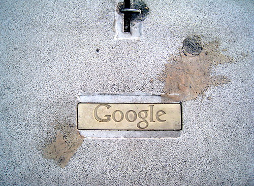
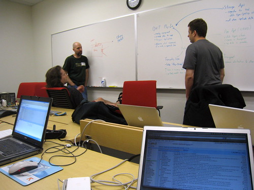

I feel like writing a blog entry right now about as much as I feel like putting a spinning drill-bit into my temple. But I really wanted to jot down some of my thoughts from today before I passed out.

There’s a group of seven of us down in Mountain View right now. The purpose of this trip is to try and hash out a complete peer-to-peer communications protocol based on open-standards. When it’s complete, it will essentially be an open source framework that will allow functionality similar to Skype, including encryption between nodes, even in an adhoc configuration.

This trip marks the first time I have spent any significant time on the Google campus. One of the first things you notice is how many perks the employees get. There is free food and beverages scattered all over the buildings. The good thing is that they really strive to make sure everything is healthy, which is why there are no-sugar-added fruit drinks in most of the fridges, and nuts and berries for snacks. Google employs high-end class chefs in all their cafeterias, and the food that comes out is extremely varied, tasty, and ultimately healthy (they have nutritionalists on staff to ensure the latter).

You’ll see kids in the building, dogs, and the odd person getting a haircut or a massage right in the building. There’s a full gym, pick-up sports, outdoor courts, bicycles for employees to bike between buildings, and even daycare for the parents that require supervision for their children. The main idea is to remove as many distractions from employees so that they can work without being stressed or worried. I had dinner in the Google cafeteria at around 8pm tonight, and the place was still fairly packed.

We spent most of today hashing out an API for the peer to peer framework. There were lots of debates, a few heated moments, and lots of time spent honing the finer points of the interaction amongst the various components. It was a long, 14 hour day, and thankfully we’re done most of planning.

Tomorrow we’ll get to Google early in the morning and spend most of the day locked in a conference room writing C++ code. We’re hoping to have a functional vertical tomorrow, which basically means we’ll have a somewhat working, but stripped down version of the end product, mainly as a proof of concept.