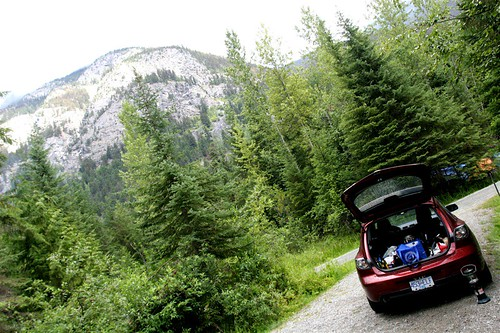
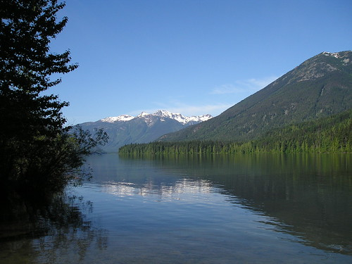

Birkenhead Lake, last summer

At the Matthew Good show the other night I ran into a good friend of mine from high school. We ended up chatting and drinking beers over at Doolin’s after, and it was great to catch up. Rob and I became friends back when I was working at Bonanza when I was 16, and I haven’t talked to him in a few years.

Birkenhead Lake, photo by [wenno on flickr](http://flickr.com/photos/wenno/)

It turns out that both Rob and I are on vacation this week with not a whole lot to do, so we decided to head up to Birkenhead Lake tomorrow and just chill out over a few beers. Birkenhead was the biggest surprise of last summer, and it’s one of the nicest campgrounds I’ve been in. It’s close to Whistler, and it boasts huge campgrounds with a nice glacier fed lake. So it should be a great couple of days.