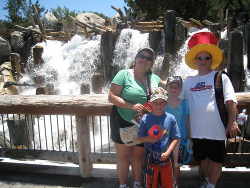
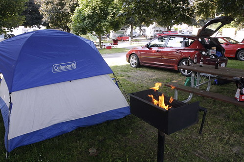
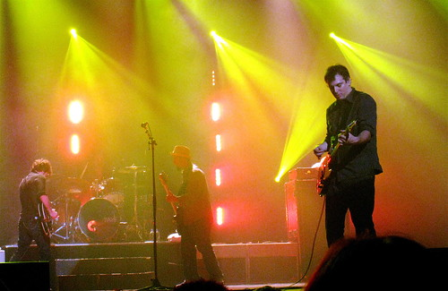
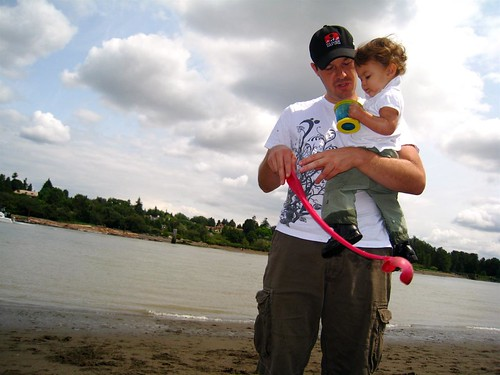

Well, thus marks the end of my first two-week vacation stint. This vacation saw me bounce from San Francisco, to Los Angeles, back up to Vancouver, to a Matthew Good show, then to the North Cascades, up to Whistler, and then back home. Not bad for just over two weeks.

Golden Gate Bridge, taken during my trip

It was great getting to hang out with my sister, brother-in-law, and their two kids down in Disneyland. Despite only being an hour and a bit away, I don’t get a chance to head home that often. Plus, I haven’t really spent much time with my niece and nephew (although I was there in Chilliwack Hospital when my niece popped out), so it was a good bonding experience with both of them.

I gave up caffeine again a few days ago, and already I feel a ton better. To be quite honest, most of the time I find that I lack the motivation to really get out and do anything. Most of the reason is that I rarely get a good night’s sleep, and typically feel perpetually tired I’m not sure if it’s because I just took two weeks off, or if it’s because my body is now caffeine free, but I feel amazingly better and more upbeat. In fact, the last two days I’ve actually gotten up naturally at 8:30am or so, and spent the day bouncing around, even doing a pile of chores I’ve been meaning to do for, oh let’s see, the last year or so.

Camping Near Seattle

Yesterday I spent two hours and completely overhauled my car. It basically looks as good as new now (ignoring, of course, the huge dent in my back door that still needs to be fixed). The inside still smells a bit like camping, but once I vacuum the carpets I’m fairly certain it will be as good as new inside as well. I also picked up some tupperware for the trunk so that I can store all my camping stuff in it and easily pull it out when it’s not in use.

Matt @ The Orpheum

This morning I got a call from Jeff, and he asked if I wanted to head down with him and his daughter to Macdonald Beach Park for a few hours. It was directly beside the airport, and was a really nice spot to chill out and let his dog run up and down the beach.

Afterwards, I swung by the new Home Depot on Cambie and picked up a wall shelving-unit for my room so that I’ll finally have somewhere to pile all my clothes. I have, embarrassingly enough, been without a dresser ever since I moved into this place, and subsequently have been forced to pile some of my clothes on my bedroom floor. While this is only marginally better, it’ll be nice to have everything organized again, and will make it unlikely that bacon can successfully hide in my room in the future.

Tomorrow I head back into work. I’m just finishing up a pile of laundry and then I’m going to hit the hay. I’m going to try and get myself back on a morning schedule, since I’d like to be home in time to cook myself dinner for the next little while. Also, there’s a chance that I’ll be heading to Serbia in the next week or two to help with a project out there. If I go, I’ll be gone for four weeks or so. It’s nowhere near for sure yet, but if it does happen, I think it’ll be a really great experience, and I’ll get to see some of Europe I’ve never seen before.

Anyways, thus ends my vacation. The next one will probably be in the fall or early winter.