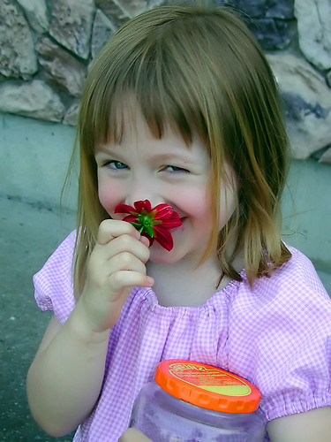

Today (Tuesday) is my niece’s 10th birthday. It seems like just yesterday I was out working at UBC when I got the call telling me that my sister had gone into labour. I left work and made the trek back to Chilliwack, and made it to the hospital just in time to see the first few minute’s of Jessica’s new life.

That photo is one of my favourites of my niece. It was probably taken when she was only 5 years old or so, but it was one of the first times I got to spend alone with her (I had been living out in Ottawa for a few years prior to that). I had told my sister that I was going to go to Burger King and get myself something to eat. Jessica came up to me, grabbed my hand, and asked me if she could come along. What uncle could refuse?

I caught her outside not long after, a jar full of bees in one hand, a flower in the other, and managed to snap this photo of her. It is a shot that always makes me smile, and somehow reminds me of the type of person she is.

I recently spent a few days hanging out with her down at Disneyland, and it was great to finally have some more time with her. Every time I see her she is that much bigger, and that much more of a little lady. So on this, your tenth birthday, I wish you an amazing day. And know that your uncle loves you very much!

Happy birthday kiddo.