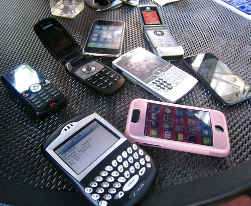
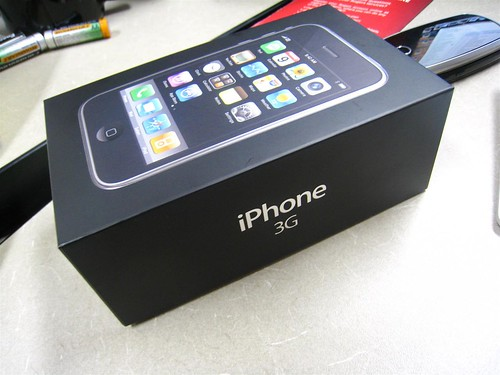

Well, to say that today was a complete clusterfuck would be a gross understatement. I arrived at the Rogers store around 9am, and spent the next five hours watching Roger’s employees desperately try and activate my iPhone for me.

I actually ended up at a hold-in-the-wall Rogers store, which was great because there wasn’t a huge line-up. Ironically, I ended up right behind my plastic surgeon in line, which was actually pretty cool because I got to spend 90 minutes just chatting with him and getting to know him.

They had 14 units at the store I went to, and only 4 at the Yaletown Rogers store. I heard that the fools at the Broadway store waited in a line 100 deep for hours on end and most of them didn’t even get iPhones. After spending most of the day there, I managed to walk out around 2pm with a brand new 3G iPhone in my hand.

Having a full data plan makes all the difference. I’ve had an iPod Touch for six months now, and I’m fairly used to how to use the device. But when you couple the technology with a full data plan, it’s an entirely different experience. In fact, I’m fairly certain I’m going to die by being hit by a bus or by being run over by a backhoe, since I spent all day walking down the road without watching where I was going.

It’s pretty cool, and I’m totally having a lot of fun playing with it.