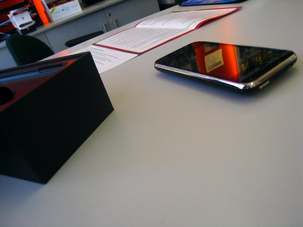
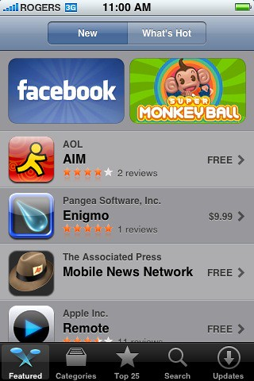
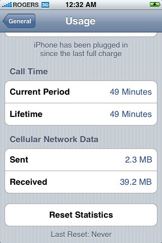

I’ve been messing around with the iPhone 3G pretty much non-stop for the last 24 hours. For the most part, it has exceeded my expectations.

First, being able to check your email or surf the web from any location is a pretty awesome feature. For example, today I was at the beach with some friends and we noticed that the tide was slowly creeping up the shore. I quickly fired up Safari, did a Google search for “Vancouver Tide Table”, and determined that high tide was in about two hours.

As most people know, the iPhone 2.0 firmware brings with it the iPhone application store. I’ve already purchased two applications, the premium Twitterific app and the Flickr app. The Twitterific app is a bit more polished, but the Flickr app is fully functional and will probably make life with Flickr that much easier.

One application that is notably missing is something to share your current location with your friends. The AGPS system in the iPhone works surprisingly well with the Google maps application, but I have yet to have it work well with anything else. I updated my location in Twitter today using the Twitterific application, only to realize that it was about 2 or 3 miles off when someone viewed the location from my Twitter profile. Ideally, I want a way to send my GPS coordinates to someone so they can find me. I was trying to tell John Biehler how to get to the beach we were at today, when I really should have been able to fire him off a URL of where I was and have him walk right up to me. Perhaps that functionality is buried in the iPhone somewhere, but I haven’t found it yet.

I was pretty worried with the battery life yesterday after I picked it up. It was 50% full when I purchased it, and I nearly ran it down to 0 by the time I got home. I gave it a full charge overnight, and was relieved when I got home tonight and it was still nearly full. So battery life seems to at least be good enough to do a full day or random calling and surfing.

One disappointing aspect is that the iPhone 3G doesn’t appear to work with my iPod dock. The current dock I have has worked for three generations of iPods (the original, the nano and the touch), so I was disappointed when I plugged it into my stereo dock as night only to be told by the iPhone that it wasn’t compatible. I can’t really imagine a scenario where Apple couldn’t make it work with the old dock if they wanted to (the pin configurations are the same), so I can only conclude that the purposefully broke it so people would be forced to buy new docks for the iPhone 3G.

I also signed up for a trial [Mobile Me](http://me.com) account tonight. Mobile Me is Apple’s new web-based service that can synchronize content between Mac devices in real-time. One nice thing about the Mobile Me service is that it operates off a PUSH delivery system, which means that it automatically sends data to all devices immediately after the data is changed. The opposite of that is a PULL system (often called polling or fetching), where each device periodically checks for updates, even if none exist. The PUSH system is obviously far more efficient, and ultimately uses less battery life (since no data is transferred when no updates are available). I have to say, it’s pretty cool seeing your iPhone chirp about 3 seconds after you send an email to your Mobile Me address. I also updated a pile of contacts on my Laptop to see what would happen on my iPhone. Without any intervention, the contacts on my iPhone automatically changed as well within about 15 seconds of finishing synchronizing them on my laptop. Pretty cool.

Unfortunately, the Mobile Me website seems borked right now, and it won’t let me log in using my credentials. Until then, I won’t be able to see how it compares against Google’s suite of products.

In terms of data usage, it would seem I haven’t used all that much. In the 36 hours or so that I’ve had the device, I’ve only used 40MB worth of data. I would consider myself in the “power user” category, and I’m actually a bit surprised that it’s so low. I imagine once I start uploading photos routinely it will climb, but at my current rate I’ll barely hit 1GB worth of data this month.

One thing I have noticed however is that the user interface seems a bit sluggist on the iPhone 3G compared to my iPod touch. I played around with John Biehler’s device today, and although it seemed slightly snappier, you can see a slight delay when bouncing between contacts or adding new ones. I’ve been told that the original iPhone firmwares also had speed issues, and slowly improved with each iteration. So hopefully the next version of the 3G firmware will make the UI a bit peppier.

All in all, I’m extremely happy with my purchase, and would definitely recommend it to anyone looking for a mobile computing device. Surprisingly, I haven’t really made that many calls with it since I’ve gotten it. In fact, I consider the ability to surf and interact wirelessly over 3G the device’s main selling point.

\*\* Update – Also, the iPhone 3G doesn’t appear to support the 802.11n. That’s pretty disappointing considering every Mac product in my house is using it, including my new Airport base station. The only way I can make my iPod touch work with it is to reconfigure my router to do a+b as well as n, but that means I can’t use the 802.11n in wide mode. Maybe I’ll bridge my router at home with another 802.11b router I have, but that’s a huge pain in the ass. I’m really surprised 802.11n isn’t supported on the iPhone 3G.