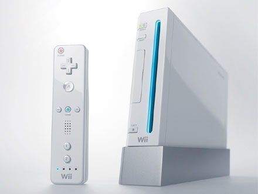

The company where I currently work is currently offering a draw for at least one Nintendo Wii (more if I remember correctly). To be eligible, they are asking people to fill out a quick survey to get a bit of data with regards to telecommunications. Everyone reading this blog should be eligible.

So, if you’d like to potentially win a Nintendo Wii, I’d ask if you guys could please fill out a five minute survey.

If you’re just a regular person (i.e. not a business owner), please fill out [this version.](http://spreadsheets.google.com/viewform?key=pdbRU91eq8TSBxKVQD6pCaQ&hl=en)

If you’re a small to medium sized business owner, please fill out [this one.](http://spreadsheets.google.com/viewform?key=pdbRU91eq8TSBwRWUzaQsMQ&hl=en)

Also, please drop a quick comment if you filled it out. I’ll keep everyone up to date with the winner of the Wii(s) when it’s all over.