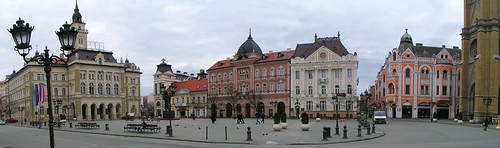
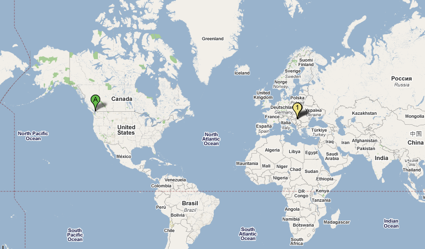

Those of you that [follow my Twitter feed](http://twitter.com/duanestorey) probably noticed that I *almost* made it to Serbia about a week ago. I was scheduled to fly over there to spend a month helping out our software development team, but at the last minute it all fell apart.

It appears that all the stars at work have realigned, and I’m most likely heading to Serbia this week. I’ll be gone most likely for around four weeks, and will be getting a small apartment out there. My flight will most likely take me from Vancouver to Frankfurt, and then onwards to Belgrade. From Belgrade, I’ll be taking a car or a train up to Novi Sad, which is the second largest city in Serbia, and home to the [Exit Festival](http://www.exitfest.org/). All in all, that’s probably around 20 hours of traveling, so it’s quite a long ways to go.

Photo by [Niels van Kampenhout](http://flickr.com/photos/nielsvk/)

Other than a quick trip to Finland about 18 months ago, I haven’t really spent any time in Europe. Serbia is supposed to be really beautiful, and the weather is consistently hotter out there this time of year, so it should be a good trip.

It’s a strange thing to be gone more than a week though. I do lots of traveling, and whenever I leave I generally approach packing a certain way. If I’m going to be gone for three days or less, I just pack a quick weekender suitcase. Anything from about three days until ten days is one suitcase. After that, I’m in uncharted territory. I actually think I’m going to pack really light and just plan to buy some clothes out there. I’d like to keep myself mobile in case I have a few days at the end where I can possibly see Rome or Prague before coming home.

Anyways, I still don’t have a plane ticket, but it’s looking pretty likely that I’m heading out this week. Should be an interesting adventure.