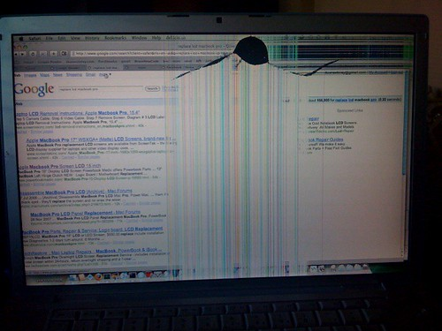

I pulled my laptop out of my case tonight and fired it up. I was immediately greeted with this:

$1000 worth of fail

As you can see, my LCD has a wicked crack in it. I did a quick scan in the forums, and replacing an LCD via the Apple store runs about $1000, which is rather insane. Thankfully I found a few companies on eBay that are selling the raw LCD screens for around $200, so I put in an order for a replacement. Hopefully I’ll be able to install it myself when it comes in the mail.

So as of right now, I’m without a laptop. Thankfully I have an iMac at home as well, so I’m not really in any trouble. But I do use my laptop quite a bit, so would like to get it up and running as soon as possible.