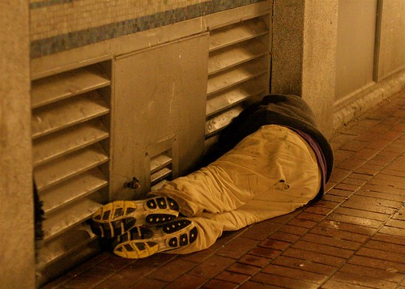

As you can tell, this is my first entry for the 2008 Blogathon. The purpose of blogathon is to, over the course of 24 hours, blog and attempt to bring some exposure to a local charity of our choosing. For me, I have chosen to represent the [Union Gospel Mission](http://ugm.ca), a Vancouver charity that helps the homeless and those in need.

Another Long Night In Vancouver

The housing crisis in Vancouver is worsening, and many people find themselves without shelter each and every night. Those individuals, who are a part of this city, are often neglected and left to rot on the streets while our government dumps hundreds of millions of dollars into tourism or events like the Olympics. Without organizations such as the Union Gospel Mission, many of these people might not last long on the streets. That’s why I’m hoping I can encourage a few people to support the cause, and help some of these individuals out.

Writing 48 blog entries in a mere 24 hours is obviously quite the challenge. I will do my best to mix the entries up and to try to make them as interesting as possible. There will be a mix of important pieces, personal entries, the odd reflection, and even a few guest entries from some friends.

One thing I haven’t done a lot on my blog lately is write about personal matters. It was something I used to do quite frequently, and something I used to pride myself in. But lately, I’ve been so swamped that I haven’t even really stopped to even think about how I’m doing. Given that I’ll have the next 24 hours to do some serious thinking, I’m hoping I can post a few tidbits that will hopefully shed a bit of light on how I’m doing.

A major change happened to me a few years ago, directly as a response to me flying through a plate glass window. Over christmas that year, while lying in a bed in Chilliwack feeling sorry for myself, I started to actually question many aspects of my life, including religion, love, and mortality. It was a period of great stress in my life, filled with endless questions and very few answers. At the end of it all, I finally gained some solace with the knowledge that the things I was stressing about were entirely outside of my control, and not really worth getting worked up about. That revelation also led me to realize that the only real variable that I had complete control over was how I ultimately treated others in this world.

So with that in mind, I’m proud to lend my fingers and my blog to a worthy cause that will hopefully help brighten a few days in the lives of some of Vancouver’s less fortunate. To that end, I thank everyone who will spend some time reading these entries over the next 24 hours, and give my thanks to those that have the means to [donate to the cause](http://miss604.com/blogathon). So far we’ve raised $140 with my blog, and I’m hoping with everyone’s help we can push past $1000 by tomorrow night.

All the best. See you in 30 minutes.