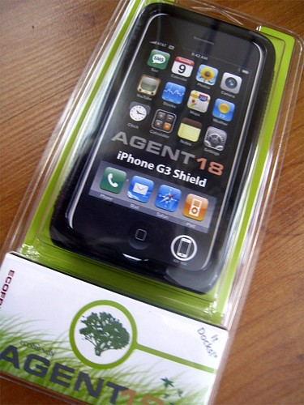

A while ago I posted about my recent purchase of the Agent 18 Eco-Shield product. I received it via FedEx the other day and have had it on my iPhone ever since. I thought I’d give a quick review of the product.

Agent 18 Eco-Shield

First, I have to say that my primary motivation for purchasing the product was that it is supposed to be made entirely from recycled plastic. The product is indeed made of plastic, and fits my iPhone 3G perfectly (the last case I bought didn’t fit properly at all). Unfortunately, while I love the case, I have to say I was extremely disappointed with how much packaging this product uses. As you can see in the photo, the packaging is made entirely of plastic, and is much larger than the actual product itself.

I emailed the manufacturer, hoping to get a response before I wrote this, but so far I haven’t heard anything. It’s possible the packaging is made from recycled plastic as well, but it’s not entirely obvious to me after opening it. But if it’s not made of recycled plastic, then I sincerely hope they rethink their product in the future.

This entry was written for [Blogathon 2008](http://www.migratorynerd.com/tag/blogathon), and in support of the [Union Gospel Mission](http://ugm.ca) charity. If you’d like to donate to the cause, please visit [the blogathon donation page](http://miss604.com/blogathon) and fill out the form near the middle. You can also [follow the blogathon RSS feed for this site by clicking here](http://www.migratorynerd.com/tag/blogathon/feed).