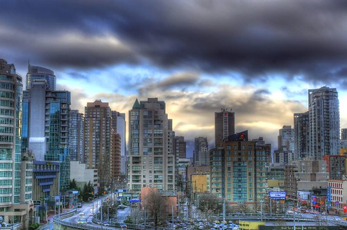

As most of you know, I really enjoy photography. I have been fortunate enough to have received a bit of recognition for some of the shots I’ve done, and even managed to attend the [2008 Canadian Juno Awards](http://www.migratorynerd.com/2008-juno-awards) as a photographer.

I thought I’d post a few of my favourite shots here for those that are new here.

Most of these shots make use of a technique called high dynamic range (HDR) photography.

This entry was written for [Blogathon 2008](http://www.migratorynerd.com/tag/blogathon), and in support of the [Union Gospel Mission](http://ugm.ca) charity. If you’d like to donate to the cause, please visit [the blogathon donation page](http://miss604.com/blogathon) and fill out the form near the middle. You can also [follow the blogathon RSS feed for this site by clicking here](http://www.migratorynerd.com/tag/blogathon/feed).