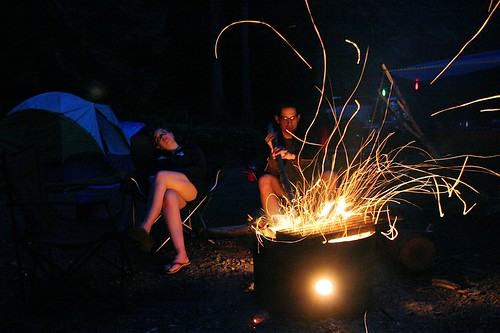

I love camping. It’s perhaps the second most enjoyable thing in my life these days, the first being a nice, toasty warm plate of nachos. There’s something magical about a campfire next to a lake, or sitting around drinking a few beers under the stars with people you care about.

I have always, for as long as I can remember, had trouble sleeping. Part of the reason is that I have a bad back (due to an injury I obtained in high school), and frequently wake up when I have an achy back. I also find that most city noises wake me up, and that I generally toss and turn most nights. The only time I find I can sleep easily is when I’m either lying in bed with my arm around someone warm, or when I’m curled up in a sleeping bag with the sound of a running stream somewhere in the distant background.

Last year I hardly got out camping at all, and I’m extremely pleased that I have made it out four or five times this summer already. I’m hoping to get one more big trip in with all my friends, at which point I’ll be able to look back fondly on the summer of 2008, and all the great camping trips I did with my friends.

For whatever reason, lots of people I meet are opposed to the very idea of camping. They either can’t handle having a bit of dirt on their fingers, or are adamant that they need a hot shower or a bubble bath every day. In terms of the girl I eventually end up settling down with (if such a girl exists), being someone that enjoys camping and the outdoors as much as I do will obviously be a fairly large requirement. I would love to find someone that would hop in the car with me at a moment’s notice, and end up next to a lake a few hours later in front of a warm fire. Maybe someday.

This entry was written for [Blogathon 2008](http://www.migratorynerd.com/tag/blogathon), and in support of the [Union Gospel Mission](http://ugm.ca) charity. If you’d like to donate to the cause, please visit [the blogathon donation page](http://miss604.com/blogathon) and fill out the form near the middle. You can also [follow the blogathon RSS feed for this site by clicking here](http://www.migratorynerd.com/tag/blogathon/feed).