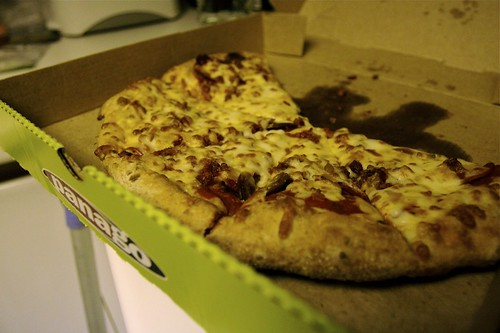

It’s around 4am, and I’m drafting this post on the couch, glancing up occasionally to watch a bit of Dances With Wolves on Apple TV. I’m on entry #15, which means I have about 33 left to go. I am already faltering a bit with regards to content, which I think is more of a result of my lack of sleep rather than my imagination. I’m hoping to actually post an entry or two in advance and grab a wink or two if possible. Otherwise I’ll be forced to do nearly a 40 hour stretch without sleep, which I imagine will prove rather difficult come tomorrow night.

John and Raul both left sometime ago, so I am basically sitting in the dark leaning over my iMac. It was rather nice having a bit of company, and made it that much easier to stay the course. Now that they’re gone, I have only my Apple TV and a few night-owls on Twitter to keep me company.

I got fairly hungry a few hours ago, and decided to order a bit of pizza. I normally order from Bella pizza downtown, but for some weird reason most of the pizza places in this city close at midnight. That in itself is rather strange considering most pizza places in my hometown of Chilliwack are open until 2am or later. So, I was forced to order from [Panago](http://panago.com). They actually have these new multigrain crusts that ended up being a lot tastier than I originally imaged.

I won’t know how the donations are going until Rebecca wakes up in the morning, but so far I think I’m at around $200. Every donation is appreciated, and I’m hoping a few more people will be able to lend some support to my cause before this is all over.

This entry was written for [Blogathon 2008](http://www.migratorynerd.com/tag/blogathon), and in support of the [Union Gospel Mission](http://ugm.ca) charity. If you’d like to donate to the cause, please visit [the blogathon donation page](http://miss604.com/blogathon) and fill out the form near the middle. You can also [follow the blogathon RSS feed for this site by clicking here](http://www.migratorynerd.com/tag/blogathon/feed).