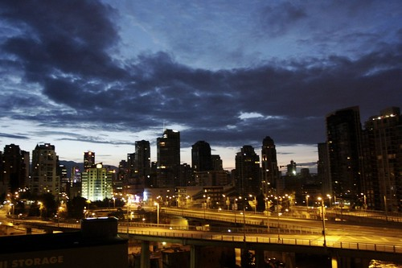
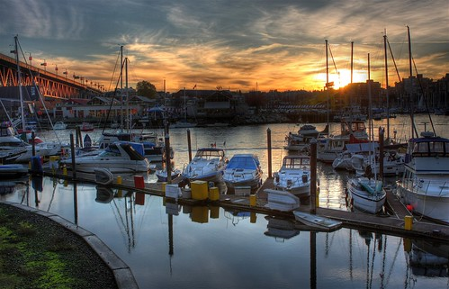

A New Day Begins In Vancouver

I took this photo at around 5am this morning. Watching the sun rise or the sun set is something I will never tire of. Seeing the orange-red glow stretch across the horizon always makes me think what a beautiful thing it is to be alive, and what an amazing part of the world I live in.

There are some people who think sunsets are cliche, and that taking photos of them is a waste of time. But I think the complete opposite, and as long as I have a camera, there will always be a sunset or a sunrise worth taking a photo of.

This entry was written for [Blogathon 2008](http://www.migratorynerd.com/tag/blogathon), and in support of the [Union Gospel Mission](http://ugm.ca) charity. If you’d like to donate to the cause, please visit [the blogathon donation page](http://miss604.com/blogathon) and fill out the form near the middle. You can also [follow the blogathon RSS feed for this site by clicking here](http://www.migratorynerd.com/tag/blogathon/feed).