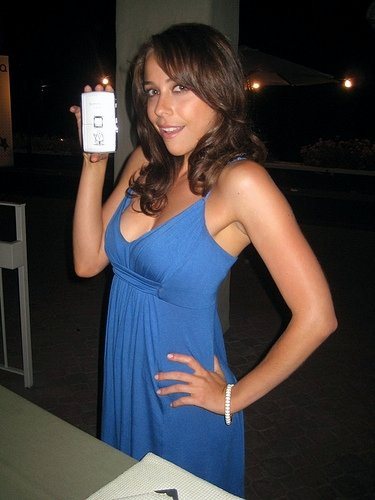
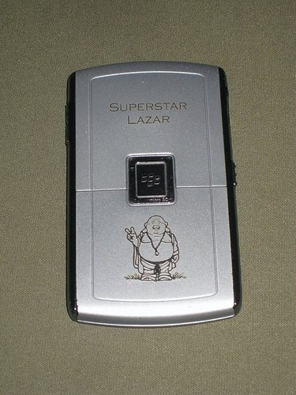
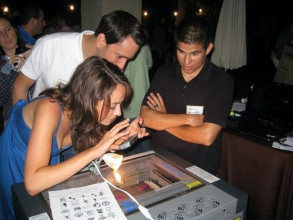
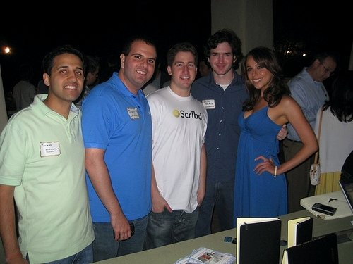

The following is a guest post by the always lovely Shira Lazar. Shira is an amazing reporter based out of Los Angeles, and was nice enough to offer to help me out with a guest posting. You can read more about Shira Lazar on [her main site](http://shiralazar.com/), or head on over and check out her blog, [The Pop Report](http://thepopreport.com). Thanks again Shira!

After a few hours of sleep, I’m back and ready to rumble in San Fran. My fellow Canuck and blogger, [Duane Storey](http://www.migratorynerd.com/2008/07/blogathon-2008-starting-tonight-at-10pm/), has been doing a 24-hour blogathon for charity starting last night at 10pm and has been getting friends to do guest entries- so here’s my contribution.

Last night at the Techcrunch August Capital Meetup, they had this great booth for a company called [Etchstar](http://etchstar.com/), which engraves phones, laptops, etc with the insignia of your choice. Check out the pics below of my crackberry getting branded and zenned out. Thanks to the lovely Karina Grotz for the pics!

BTW- I was definitely the black sheep last night sans Iphone. Made me feel like I should take the leap and buy one. Hmmm decisions, decisions…

Here’s a photo of me and Karina Grotz from Etchstar

And a photo of my crackberry transformed:

Here’s me video blogging the process.

Here’s one of me hanging out with da boyz. Including from left my friend and [Doctoc.com](http://docstoc.com/) founder (and the guy who got me out for the event) Jason Nazar and his Scribd competitor. I made sure they didn’t get into a brawl.

This entry was written for [Blogathon 2008](http://www.migratorynerd.com/tag/blogathon), and in support of the [Union Gospel Mission](http://ugm.ca) charity. If you’d like to donate to the cause, please visit [the blogathon donation page](http://miss604.com/blogathon) and fill out the form near the middle. You can also [follow the blogathon RSS feed for this site by clicking here](http://www.migratorynerd.com/tag/blogathon/feed).