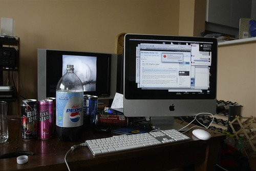

Well, I imagine by now many of the early morning shift people are in full swing. It seems like so long ago I wrote my first entry, and here I am at number 28. It sure is getting difficult finding content on short notice, but I’m managing to stay ahead of the curve somehow.

My Blogathon Setup

Rebecca did a quick tally on her blog, and I think between all the participants we are up to around $500 so far. That number doesn’t include people who have gone directly to their charity’s website and donated directly, so ultimately the number will be a bit higher. In terms of people on this blog, we’ve raised about $210 $260 so far. My goal was to hit $1000, which may be unrealistic, but given that we still have another 20 entries to go, I’m hoping that number can still go up quite a ways.

Money isn’t everything, and if you support the Union Gospel Mission, you can still make a difference by supporting some of the bloggers during blogathon, dropping by the Union Gospel Mission website from time to time, stay informed, or even try and volunteer sometime in your community. Every little bit counts, and everyone can make a difference.

I created an RSS feed last night that represents alot of the bloggers currently doing blogathon. If you want to add it to your RSS reader, you can [subscribe to it here](http://pipes.yahoo.com/pipes/pipe.run?_id=EP1giuFa3RGd7qe_1ZzWFw&_render=rss). If you’re not in the list, then simply fire me off a quick email and I’ll make sure to add you.

This entry was written for [Blogathon 2008](http://www.migratorynerd.com/tag/blogathon), and in support of the [Union Gospel Mission](http://ugm.ca) charity. If you’d like to donate to the cause, please visit [the blogathon donation page](http://miss604.com/blogathon) and fill out the form near the middle. You can also [follow the blogathon RSS feed for this site by clicking here](http://www.migratorynerd.com/tag/blogathon/feed).