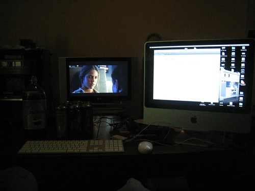

Blogathon is a team effort, and as such, I’m happy to be blogging along side of some of Vancouver’s best bloggers.

So, here are some shouts to some of my fellow bloggers participating in Blogathon, not all of who are on the sunshine shift tonight (but will be checking in at various times during the weekend):

[Tania Morrison (Ottawa)](http://whatusernameisnttaken.blogspot.com), [Raul](http://www.hummingbird604.com), [Shane Gibson](http://www.closingbigger.net), [Karen Hamilton](http://tinybites.ca), [Ayeza Garcia](http://balikbayanbox.pansitan.net), [Isabella Mori](http://moritherapy.org), [Danny Dang](http://dannydang.com), [Mehnaz Thawer](http://www.strawberryghetto.blogspot.com), [Jenn Lowther/Nadia Nascimento](http://www.invokemedia.com/blog), [Barbara Doduk](http://iamlove.blogspot.com), [Chris Richardson](http://www.tagga.com), and [Colleen Vince](http://353review.com).

I had a little nap after work tonight hoping that it would give me a bit of extra leverage when it comes to spending the next 24 hours awake. It was probably the right thing today, but I’ll admit I’m fairly spaced out right night now and feel like just hitting the sheets and sleeping again. But rest assured, I’m in this for the long haul.

[Rebecca](http://miss604.com)‘s husband [John](http://johnbollwitt.com) just showed up with a pile of caffeine and a bag full of moral support. I’m trying my best to work on my broken laptop right now, but it seems pretty clear that this is rather futile, and I’ll have to switch over to my iMac in the other room to write most of my entries.

Ok, I took a five minute break and moved my iMac from my bedroom out into my living room. This will be a much better setup and will allow me to blog from the television. You can see my sample setup here:

As I mentioned before, I’m hoping to have a few guest writers up over the course of the next 24 hours. If you find any articles that you think would interest my readers, please [contact me](http://www.migratorynerd.com/contact). I also want to thank my mom, Valerie Storey, for her recent pledge. That puts us up to about $210.

This entry was written for [Blogathon 2008](http://www.migratorynerd.com/tag/blogathon), and in support of the [Union Gospel Mission](http://ugm.ca) charity. If you’d like to donate to the cause, please visit [the blogathon donation page](http://miss604.com/blogathon) and fill out the form near the middle. We have currently raised $210 for this cause, and my goal is to reach $1000 before the end of tomorrow night.