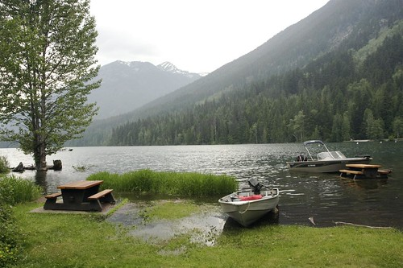
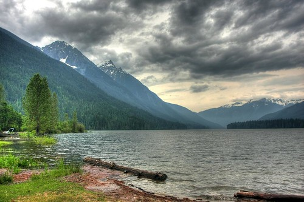

Two more people have donated recently to the Union Gospel Mission. They are: - Kevin Haggerty
- Grant Jordan

Thanks for your support. If anyone else pledges before my next entry, drop a comment or an email and I’ll make sure I add your name. I don’t have the exact number, but I think that brings us close to $300, with a goal of $1000. So if you can help us hit that goal, please head on over to the [pledge page and lend some support](http://miss604.com/blogathon).

To sweeten the deal, I’ll give any person who donates $50 or more to the Union Gospel Mission an 8×12 photo of your choosing from my HDR gallery located at [SmugMug](http://duanestorey.smugmug.com/gallery/3418360_rtJCf#191460517_NaefR).

One of the techniques I’ve played with a lot over the past year is in the area of high dynamic range (HDR) photography. It’s essentially a way to capture far more dynamic range of a scene than a typical camera would normally capture. You basically have to set your camera up to capture a scene using various different shots at different exposures. I have a detailed tutorial [available on my website](http://www.migratorynerd.com/hdr-tutorial),

The benefit of this technique is that it mimics basically what the eye actually saw when you were there. Cameras have a limited dynamic range when compared to the human eye, and hence can only capture a small subset of the detail in a real scene.

The give an example, here are two shots I took of roughly the same scene a few weeks ago.

The first is a shot that I took normally, that is without any HDR techniques applied:

Non-HDR Shot Of Birkenhead Lake

Now, here’s a version in slightly a different position that I made by combining three different exposures into one shot:

HDR Shot Of Birkenhead Lake

As you can see, there is a lot more detail in the second shot, particularly in the clouds and some of the highlights on the vegetation. When used in excess, sometimes HDR shots end up looking artificial, but if you can keep them rather tame, most of them end up giving a rather realistic impression of the actual scene.

This entry was written for [Blogathon 2008](http://www.migratorynerd.com/tag/blogathon), and in support of the [Union Gospel Mission](http://ugm.ca) charity. If you’d like to donate to the cause, please visit [the blogathon donation page](http://miss604.com/blogathon) and fill out the form near the middle. You can also [follow the blogathon RSS feed for this site by clicking here](http://www.migratorynerd.com/tag/blogathon/feed).