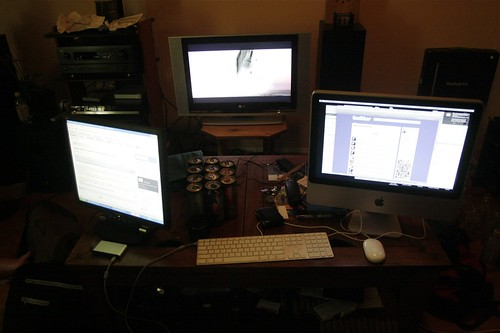

First off, I’m going to put together a Blogathon-wide RSS feed so that people can follow what everyone is doing on blogathon without having to visit each site individually. You can subscribe to it [by clicking here](http://pipes.yahoo.com/pipes/pipe.run?_id=EP1giuFa3RGd7qe_1ZzWFw&_render=rss). Also, if you’re part of blogathon, please drop a comment and I’ll add you to the feed (I’m going to do my best to add everyone I know about), but given that time constraints of writing posts, it may take me a few hours.

Raul and John at my place

[Raul](http://hummingbird604.com) and [John](http://audihertz.com) are currently keeping me company at home. My laptop LCD broke a few days ago, so instead of committing myself to spending 24 hours at my computer desk in my room, I decided to haul my iMac out into the living room. In addition, Raul was having some major laptop LCD issues as well, so I pulled an old LCD monitor I had out of storage and hooked it up to his computer. The end result in below:

Three LCDs In Support Of Blogathon

All I had to eat tonight was some nachos, so I’m probably going to be ordering pizza sometime in the near future. We just put on The Bourne Supremacy (completed with the infamous “Shaky Cam”), and are keeping ourselves busy with that.

I’m going to peruse the Internet in a few minutes and find some more interesting things to talk about. If anyone wants me to comment on anything, just drop a comment and I’ll see if I can work it into a post.

This entry was written for [Blogathon 2008](http://www.migratorynerd.com/tag/blogathon), and in support of the [Union Gospel Mission](http://ugm.ca) charity. If you’d like to donate to the cause, please visit [the blogathon donation page](http://miss604.com/blogathon) and fill out the form near the middle. You can also [follow the blogathon RSS feed for this site by clicking here](http://www.migratorynerd.com/tag/blogathon/feed).