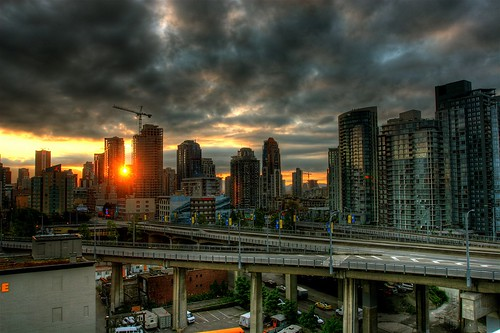

Well, there’s only five hours left in my first blogathon. It’s actually been a pile of fun, even though I’m fairly exhausted. I want to give a big round of applause to everyone that’s been a part of this event, especially those that are also nearing the end (and thankfully, get to go to bed soon). There’s a third shift starting tonight at 10pm, so there will be plenty to read tonight.

And while the blog entries and those who pen them are obviously to be commended, I think we need to all remember our respective charities, and remember the causes we are all fighting for. While I spent all last night night sitting on my couch writing blog entries, over 1000 people were sleeping outside on a sidewalk somewhere, wondering if someone might steal their belongings in the night, or stressing out wondering where their next meal would come from in the morning.

John F. Kennedy once said that since all the problems in this world are man made, they must, by definition, have solutions obtainable by men as well. So while many of the problems we face seem insurmountable, they are all solvable, and all worth putting in the effort to solve. We are all in this together, and as a collective community have the ability to end homelessness, to end poverty, and to create a future for our children that is worth being a part of.

Also, thanks to a donation by Madeline Lagden, we are now past $500. I also donated $50 as well, and am hoping somehow we can break the $1000 barrier before 10pm tonight. So if you’ve been following along and want to donate, you can do so by following the instructions below.

This entry was written for [Blogathon 2008](http://www.migratorynerd.com/tag/blogathon), and in support of the [Union Gospel Mission](http://ugm.ca) charity. If you’d like to donate to the cause, please visit [the blogathon donation page](http://miss604.com/blogathon) and fill out the form near the middle. You can also [follow the blogathon RSS feed for this site by clicking here](http://www.migratorynerd.com/tag/blogathon/feed).