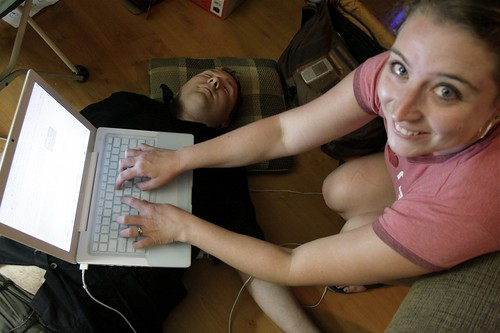

As you can tell, this is my last entry. For the last 24 hours, I have essentially been in front of a computer, blogging about various topics that have interested me, and attempting to bring exposure to the realities that the homeless face in Vancouver. Rebecca and I joined forces this year to support the [Union Gospel Mission](http://ugm.ca), an organization in Vancouver that helps the homeless and the less fortunate in this city.

First, I want to thank the Union Gospel Mission for nearly 70 years of effort with regards to helping others. By comparison, the little that most of us get to do for charity in our daily lives seems rather insignificant. Second, I want to sincerely thank every single person that dropped by and lent some support, either by donating financially, or by supporting the efforts of the bloggers in this city. It seems these days that everyone has their hand out asking for money, so I sincerely appreciate those of you that had the means to give to the cause.

At the end of the day, we are all equal, and we are all inhabitants of this planet. The problems that we have inadvertently created can be solved, but it will take all of us together to extend compassion and understanding towards each other. And while we have brought exposure to our various causes throughout the day, let us not forget that the causes we support will extend well past this weekend, and it is up to all of us to stay the course and lend a hand whenever we can.

For those of you that would still like to donate, I would definitely encourage it. You can continue to pledge [for the next few days](http://miss604.com/blogathon). I also want to thank [Matthew Good](http://matthewgood.org) for supporting this cause and for donating a personally autographed copy of his latest album, Hospital Music — anyone that donates $10 or more towards the Union Gospel Mission will be eligible to win it.

Thanks everyone. I’ll announce the final results in a few days. Until then.