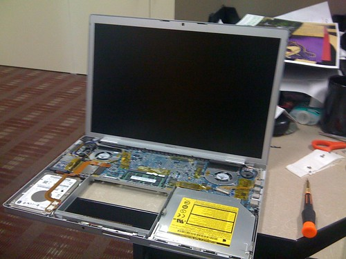
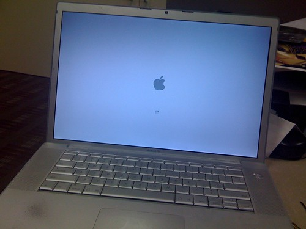

My new LCD arrived via FedEx this morning. I picked it up on the way to work, along with a Torx screwdriver to remove some of the internal pieces. I decided to take a stab at fixing it when I arrived, but it turns out it was far more involved than I thought.

I ended up having to disassemble the entire keyboard portion of the Macbook Pro. Afterwards, I had to disconnect the antenna for the wireless card, as well as the inverter for the monitor. Then, the data cable for the LCD came off, and finally the entire top portion that contains the screen.

At that point I was basically half-way. I then had to disassemble the entire upper portion, removing the iSight connection, the inverter, the data cables, and the grounding strip (which is basically big taped on copper strip) that allows the antenna to work. After that, I had to fight against a pile of glue that they put on to help hold everything in place. Sometime around then I cut my finger and started dripping blood inside. Good times.

Anyways, I was pretty sure at that point that my laptop would never go back together. But after reversing the instructions, putting all the screws back and pressing the power button, I was greeted with one of the most glorious pieces of fruit I’ve ever seen:

When the screen went black, I noticed one pixel that I think it hot. But I doubt they’ll return it for one hot pixel. Truth is that it’s only noticeable when the screen is black, so I’m not even going to worry about it.