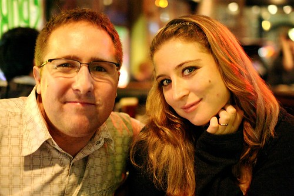

Well, I would hope that Rebecca would need no introduction in this city. But that being said, Rebecca has gone out of her way time and time again to throw link love towards other bloggers, and share whatever knowledge she can with others. So, the least I can do for a good friend is return the favour.

Over the last few years Rebecca has firmly established her blog as the most informative and relevant source of information on Vancouver life, bar none. Her blog is a enjoyable mix of personal reflections within the city, upcoming Vancouver events, and local media and band coverage. The information on her website is so widely viewed and cherished that it is, in fact, often copied by local media agencies looking for a quick story.

Far more important than that though, is my friendship with Rebecca and her husband. I actually intercepted Rebecca a few years ago on her way to the beer line-up at Northern Voice. Coincidentally, what started our friendship was a discussion we had about a living room show that our mutual friend [Matt](http://matthewgood.org) put on a few months prior. Since then, I’ve had the privilege of watching her stature, her recognition, and her knowledge of this city grow. And through it all, Rebecca has always maintained a sense of herself and a ever-present desire to improve the city in which she lives.

Just recently Rebecca organized and sponsored [Blogathon 2008](http://miss604.com), a 48 hour long event meant to generate exposure for various charities within this city. With her help and leadership, over $10,000 was raised for local charities.

Today, Rebecca had a fairly crappy day. Her husband fell sick, her health insurance mysteriously got canceled, and all the weight of the past week or so came crashing down. But, she is a trooper, and she has a lot of friends like me that care about her, so I’m sure she’ll do fine. She is an integral part of the Vancouver web-scene, a cherished part of this city, and thankfully, a very close friend.

Make sure you head on over [check her blog out](http://miss604.com) if you haven’t already.