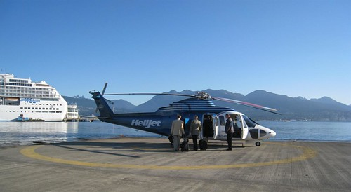
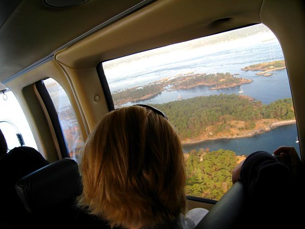
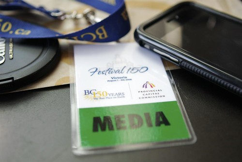
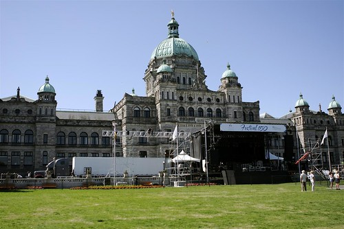

Just a quick post. I met up with Arieanna this morning at the helicopter pad for our trip to Victoria. The helicopter was a lot of fun, and surprisingly smooth. We picked up our media passes a while ago, and are about to go get some fish and chips somewhere. Look for more shots later.

You can follow my Flickr stream [by clicking here](http://flickr.com/photos/duanestorey). Also, I’ll be posting to Twitter from my iPhone throughout the day, [so add me on Twitter here](http://twitter.com/duanestorey).

