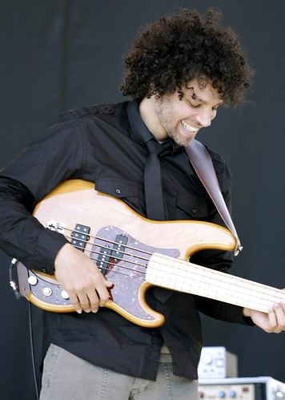
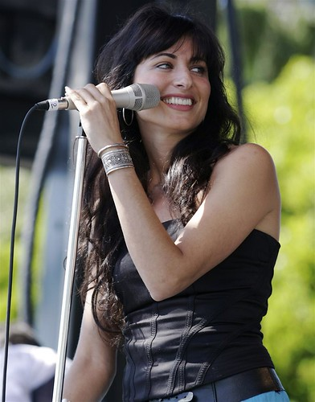
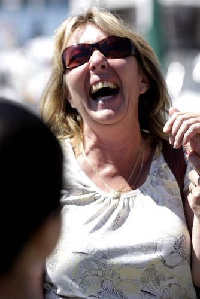

Arieanna and I spent this afternoon walking around the festivities. Today is basically the warm up for tomorrow, so it was rather relaxed. We spent time bouncing between beer gardens and the second stage, the latter of which had various talent performing throughout the day.

Ianiv took the ferry this afternoon, and will be getting here shortly. Arieanna and I sweet-talked our way onto the fireworks barge later, so we’ll have press access for that as well. I haven’t really taken photos since the Junos, so today was a good warm up day for me. Here are a few shots I took:

Also, here’s a video I took when the helicopter was taking off:

\[easyvideo video=”http://blip.tv/play/tyXGiE8A”\]