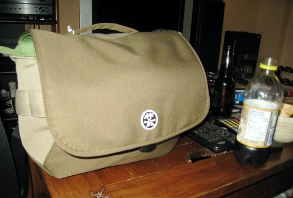

I went for a walk this afternoon down to the mall to buy a few new shirts. When I got there, I fielded a SMS message from John Biehler saying he was heading to the Apple store and asked if I wanted to meet up. I met him and Peter there, after which time we all headed down to the new Crumpler store on the edge of Gastown.

I’ve always wanted a Crumpler bag, but they were hard to come by in Vancouver. So today I picked up a new camera bag with the intention of taking it to Victoria tomorrow. Here’s what it looks like:

I opted for the smaller of the two bags they had, and I’m already regretting it. The girl said I could bring it back and get the big one if I wanted, so I might end up doing that. I’ve stuffed it as full as I can get it, and still I have extra camera pieces left over. It’s good enough for this weekend, but I really need to rethink my whole strategy. The benefit of my new bag is that I can swing it over my shoulder, allowing me to switch lenses fairly easily. With my old backpack bag, I basically had to set it on the ground, unzip it, and then fumble around. So in theory this is the better setup.

The Crumpler bag was $110, which isn’t cheap. But hopefully it’ll get the job done.

I’m heading over to the Island tomorrow with [Arieanna and Ianiv](http://blogaholics.ca) for the [big BC 150 festivities](http://www.bcfestival150.ca/). Thanks to Arieanna, I have a full access photo pass, which will give me photo-pit and backstage access to all the musicians this weekend. I’m looking forward to seeing Feist in concert, taking a pile of photographs, and enjoying a few days of festivities out in the sun. Since the ferries are undoubtedly going to be packed tomorrow, I convinced Arieanna to take the helicopter to Vancouver Island with me.

I’ve never been on a Helicopter, and I’m really looking forward to it. It leaves from the Harbour downtown, and ends up really close to Inner Harbour in Victoria. For $89, it’s really not a bad deal this weekend, especially considering it will shave off around 3 hours of traveling.

I’m just finishing doing laundry and charging my equipment, then it’s off to bed and then onwards to Victoria. Make sure you check my blog and my Flickr during the weekend, as I’m going to be posting a pile of concert photos and hopefully a few videos.