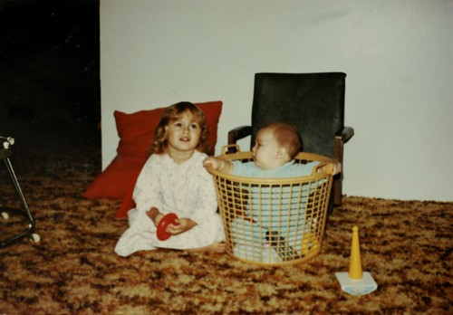
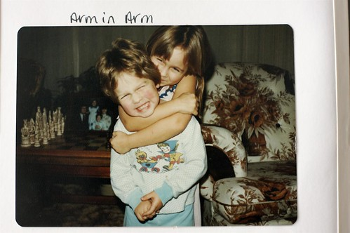

Today is my sister’s 34th birthday. It seems like only yesterday we were tromping out in the backyard together in Chilliwack.

As most people know, my family is very important to me, and I am very protective of them. My life growing up in Chilliwack wasn’t all roses, and most of us had to pull together to get to where we all are today. My university education was basically funded by various members of my family and loans from the government. My sister worked extra hard and offered to pay my phone bill every month, while my mom gave me spending money. My dad and stepmom came in and saved the day a few times when I was nearly broke and destitute. It was obviously a burden on everyone, but I’m very thankful they all pitched together to help me out. I would do pretty much anything in return to make sure they were all ok as well.

The photos on this post are actually from a big scrap-book my sister put together for me prior to me moving out to Ottawa. It’s filled with many pages of family photos, my high school friends, and a lot of good memories. It was something I took with me to Ottawa to remind me how many people cared for me back home, should I ever want to head back.

So, have a great birthday today Amanda! Try not to drink too much!

