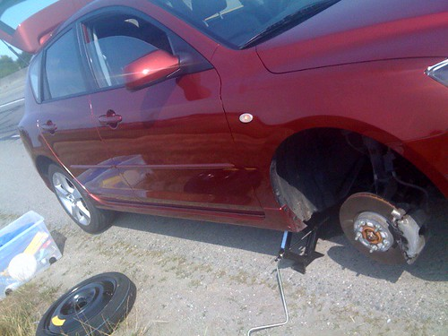

To say that yesterday was a rather crappy day would be an understatement. For several weeks now I’ve been planning on attending WordCamp in San Francisco. Since I’m paying for the trip out of my own pocket, I decided to try and be a bit more financially conscious than I usually am on trips. So I decided I would fly out of Seattle instead of Vancouver, which as it turns out was around $300 cheaper.

I was actually looking forward to the drive, and burned myself a few CDs. I went into work for a few hours in the morning, and then hit the streets heading for Seattle. Somewhere around White Rock, I noticed a really busted up portion of the highway. It seemed like there were grooves in it, and I was having a hard time keeping my car straight. When I started smelling burnt rubber, I took a look at the guy next to me and noticed that he wasn’t having any trouble keeping his car straight. It was at that moment that my heart sank, and I realized that all my perfectly laid plans for the day were basically all blown asunder if I had a flat tire.

Sure enough, my tire was ripped wide open. I actually noticed the effects of it first thing in the morning, and remember thinking it was weird that my car seemed to pulling to the right slightly. I kept checking my eBrake, because it sort of felt like something was holding my car back. It all made sense when I saw the smoking tire on my car.

At that point I had to make a choice between BCAA and myself. Given that I had little time to spare, I decided to put my spare on and try to get a new tire in White Rock. I called both Brennen and my dad to get some advice on where I should take it, and ultimately settled on Fountain Tire on King George Highway.

Unfortunately, my car takes weird sized tires, and Fountain Tire didn’t carry them. So I went further up the road to Midas. Luckily the lady there was super helpful, and managed to locate a new tire that would work for me.

Prior to leaving Midas, I did a quick internet search and found out the border line-ups were 60 minutes long at this point. I did the math and realized I basically wouldn’t make my flight at that point. I called up Virgin America to change it to a later one, but they said it would cost $190 to change it since the later flight was more expensive or something (I’m going to write a whole entry about Virgin America later, so I’ll hold off). I managed to convince the person on the line to waive the change fee, so delaying my flight only cost me $100. Even so, I was a bit disappointed having to fork out a pile of money simply to catch a later flight that day, especially considering the entire round trip ticket was only $210.

Traffic going into Seattle at that time was crazy, and I made it to the airport with less than five minutes to spare. I walked right onto my plane when I arrived at the gate, and we took off shortly afterwards.

It was a crazy day, but thankfully I made it to San Francisco at the end of it. I’m just charging a few of my toys here, and then heading down to check out WordCamp. Hopefully I’ll snap some photos and do a mini-live blog as the day goes on. So check back a bit later.