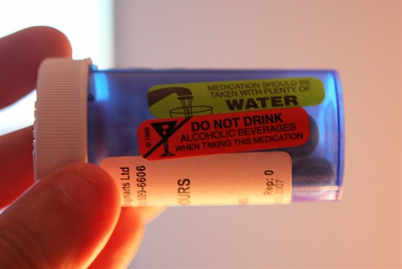

About a year ago, I was admitted to St. Paul’s hospital for what would later turn out to be a rather severe pneumonia. I don’t really get sick very often, so for me to suddenly be bed ridden after only two days of feeling bad was a very strange event. In fact, looking back I sometimes wonder if what I really had was pneumonia, or if that was just a symptom of what I actually had.

I was going over my medical records a few months ago, and found all the reports from St. Paul’s. When they admitted me I was in pretty rough shape. I had a massive fever, low oxygen in my blood, and I was so dehydrated that my blood was taking up far less volume than it normally should have. I also could hardly breathe, which turns out was due to half of my left lung actually collapsing.

Somehow during my stay in the hospital I acquired a superbug called [Clostridium Difficile](http://en.wikipedia.org/wiki/Clostridium_difficile). It’s a nasty little bugger, and it causes your intestines to become inflamed. It’s extremely difficult to treat, and many people who end up getting it need to eventually get part of their colon removed to treat it.

The first line of defense for treating it is a drug called Flagyl. Flagyl is used to treat anaerobic bacteria, and it has a lot of nasty side effects, one of which is that it can react violently with alcohol. In terms of the latter, I learned the hard way that it’s not something you should mess with. After Flagyl the only drug that has a chance against it is oral vancomycin. Vancomycin is one of the strongest antibiotics available and is typically only given out against life-threatening ailments as doctors are trying hard not to let bacteria build up resistance to it. In fact, in the United States vancomycin is a controlled substance for that very reason.

Unfortunately for me, after two rounds of flagyl and one round of vancomycin, I was still symptomatic. At that point my doctor suggested I stay off antibiotics for a while just in case the antibiotics were contributing to the problem (which is quite possible with this infection). So I spent the next two months battling it on my own, doing the occasional check-up with my doctor to make sure I was still ok.

Thankfully, after around six months of treatment, I finally was tested C. Diff negative. Unfortunately though the flora in my intestines had been massively disrupted, as well as many digestive enzymes most people have. The good news is that this should eventually work itself out naturally. The bad news is that it takes a lot of time. In the meantime though, I’m currently slightly lactose intolerant since battling C. Diff. destroyed most of the enzymes in me that deal with lactose. But hopefully in the not too distant future everything will be back to normal with regards to that.

There’s growing concern nowadays that hospitals can actually make you sicker than when you went in. In my case, given that my condition was already borderline life-threatening, I really had no choice. But I walked out with one of two superbugs, and spent a good six months battling it. Even a year later, I still feel some of the effects from a year ago, and it’s not a period of time I would really like to relive. But the good news is I’m pretty much all over it.