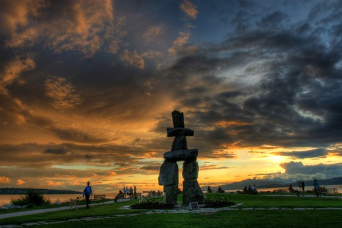

Lots of people in the WordPress community know about Dancing Matt, but I thought I’d put this up for those who haven’t heard of him. This guy named Matt has been bouncing around the world and doing a little YouTube-like video dance whenever he stops. I’m not entirely sure how it started or what it was supposed to be, but it’s amazing what it finally turned into. Here’s a little ensemble of shots from Matt’s journeys:

It actually took me a minute or two to figure out where he was dancing in Vancouver. The background looked like Yaletown, but the foreground looked like the Inuqshuk at English Bay. It turns out it is English Bay, but he positioned himself on the far side of the Inuqshuk by the water.

