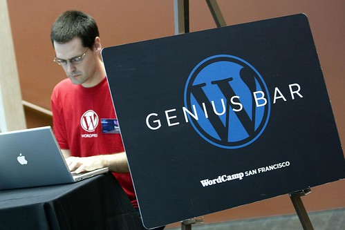

I recently had the priviledge of attending [WordCamp San Francisco](http://wordcamp.org), a conference dedicated to WordPress enthusiasts in the Bay Area. It was a great time, and I met a lot of great people.

Next month, [Rebecca Bollwitt](http://miss604.com) and I are organizing the WordCamp Vancouver event to coincide with BarCamp on Sept 27th. For those of you who are unfamiliar with BarCamp, it’s a day long conference where the participants, first thing in the morning, decide the format and the topics for the rest of the day. Everyone who attends has the potential to be a speaker, and it’s a lot of fun.

This year, the event is over on Granville Island, which is a pretty, picturesque environment for a technology conference. Rebecca and I have the first slot of the day in the big room, which should hopefully house about 100 people or so. If you have a topic you’re potentially interested in presenting, or have something you’d like to have talked about, please leave a note in the appropriate section [on the Wiki Page](http://barcamp.org/BarCampVancouver2008) (the password is c4mp). The actual people who end up presenting will be decided the morning of the event, but we’re just interested in what people would like to hear.

I’m really looking forward to the event, and am pretty excited that I get to be an organizer this year. I’m also planning on probably doing a WordPress photowalk at lunch, with an obvious photographic emphasis on WordPress (somehow!?). It should be a lot of fun. Also, [make sure to check out Kris’ photography session](http://staticphotography.com) in the afternoon — it’s always really informative. I’ll probably come prepared to talk at that one as well, just in case.

So I hope to see everyone out that weekend. Long live WordPress!