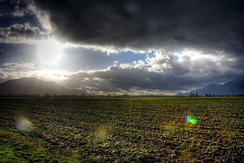

This weekend I’m going to do something I haven’t done in a long time — I’m going to head home.

To be honest, I don’t think I’ve been back to Chilliwack since easter, which is a very long time for me. I’m not entirely sure what my plans are for the whole weekend, but I’m heading back to Chilliwack at least for a few days. I might end up in Osoyoos visiting a few friends, but I’m going to hold off making any plans until after I get caught up on sleep Saturday. I’m also hoping to spend a bit of time with my grandma, since I haven’t seen her in quite a while and she hasn’t been feeling very well lately.

I’ll probably take my car to work on Friday and head back late in the evening after the traffic dies down. To be honest, I’m looking forward to kicking my feet up on the couch, turning the computer off, and relaxing for a few days.