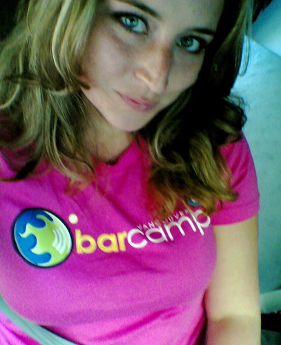

Yes people, it’s that time again. [BarCamp Vancouver](http://barcamp.org/BarCampVancouver2008) is only a few hours from kicking off down at WorkSpace in GasTown.

For those of you not familiar with it, BarCamp is an unconference where people get together and determine the topics at the conference the day of the event. Everyone who attends is potentially a speaker, so it’s a great forum for learning new things and being expose to new ideas.

[Rebecca Bollwitt](http://miss604.com) and I are organizing a session of WordCamp tomorrow down in Granville Island, which should be a lot of fun. I currently have a desk full of WordPress swag to give out tomorrow (courtesy of the guys and gals at [Automattic](http://automattic.com)), so be sure to pick up some WordPress goodies. Also, Rebecca and I will probably do a brief WordPress related social Saturday around dinner time somewhere in Granville Island, so flag one of us down if you want to come. If you’re attending, please bring along some ideas of things you’d want to hear about, or come with some ideas of what you’d like to talk about. I’ll probably come prepared to talk about some of the best WordPress plugins out there today, and why I think they are cool.

After WordCamp is PhotoCamp, which was co-organized by John Biehler and Kris Krug this time around. I’ve spoken at the last few PhotoCamps, and will probably give a brief talk tomorrow (assuming people want to hear what I have to say). I haven’t really decided what I’m going to go prepared to talk about, but the other day I was thinking it would be cool to do a quick 10 minute talk focusing on something major I learned in each of the eight years I’ve been a photographer. I came up with a partial list that I thought would be funny and informative. So I’ll probably do that. Also, if you’re attending PhotoCamp, please bring some of your gear along for show and tell.

That’s it sports fans. I’m heading down to the social tonight, then home to put my presentations together. I think Biehler is taking up permanent residency on my couch this weekend so he doesn’t have to drive anywhere, so I might have to grab a twelve-pack of beer on my way home. Tomorrow I have to be over on Granville Island before 9am to set up, and then WordCamp kicks off with a bang at 10:30am. I’m sure a few people will be live-blogging it, so I’ll throw some link-love out tomorrow for anyone interested in following along.